____
TEST du site web, réalisés par Bastien BALMES

Tous les tests ont été effectués en utilisant l'outil Cypress, un
framework de test automatisé populaire pour les applications web, qui
permet de vérifier le bon fonctionnement des applications en simulant
l'interaction de l'utilisateur avec le navigateur..
____

[width="100%",cols="50%,50%",options="header",]
|===
a|
____
*1. Connexion* +
Connexion avec compte client : +
Connexion avec mot de passe incorrect : +
Modifier les informations du compte : +
*2. CRUD vacataires* +
Création d’un vacataires : +
Suppression d’un vacataire : +
Lire les informations d’un vacataire : +
Modifier les informations d’un vacataire : +
*3. CRUD modules* +
Création d’un module : +
Suppression d’un module : +
Lire les informations d’un module : +
Modifier les informations d’un module: +
*4. Filtre vacataires* +
Filtre vacataire affecté : +
Filtre vacataire non affecté : +
Filtre vacataire en attente : +
Filtre par matière : +
Recherche d’un vacataire en fonction de son nom : *5. Filtre modules* +
Filtre par matière : +
Filtre par département:
____

a|
____
*2* +
2 +
3 +
4 +
*7* +
7 +
9 +
10 +
11 +
*12* +
13 +
14 +
15 +
15 +
*17* +
18 +
19 +
20 +
21 +
22 +
*23* +
23 +
24
____

|===

____
{empty}1. Connexion

Dès que l'utilisateur arrive sur le site, il est accueilli par un
formulaire de connexion, où il peut élégamment insérer son identifiant
et son mot de passe pour accéder à son compte.
____

[width="100%",cols="34%,33%,33%",options="header",]
|===
a|
____
Test
____

a|
____
Attendu
____

|Résultat
a|
____
Connexion avec compte
____

a|
____
Redirection vers la page vacataires
____

|Ok
|===

[width="100%",cols="34%,33%,33%",options="header",]
|===
a|
____
client
____

|Redirection vers formulaire de connexion a|
____
Ok
____

a|
____
Connexion avec mdp
____

| |
a|
____
incorrect
____

a|
____
avec message d’erreur explicite
____

a|
____
Ok
____

a|
____
Modifier les informations
____

a|
____
Change les informations du compte
____

|
|===

[width="100%",cols="100%",options="header",]
|===
a|
____
du compte
____

|===

____
Connexion avec compte client :

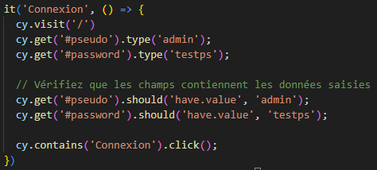

Dans ce test, nous allons saisir les véritables informations de
connexion d'un utilisateur "admin", avec "testps" comme mot de passe.
Ensuite, nous vérifierons que les champs d'identification et de mot de
passe contiennent effectivement les valeurs "admin" et "testps".

Enfin, nous cliquerons sur l'élément contenant le libellé "Connexion".
Si les informations fournies sont correctes, nous serons dirigés vers la
page de l'espace vacataire.

Connexion avec mot de passe incorrect :

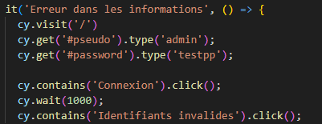

Dans ce scénario de test, nous allons délibérément entrer un mot de
passe incorrect. Par conséquent, nous anticipons la présence d'un
message sur la page indiquant "Identifiants invalides" et aucune
connexion réussie.

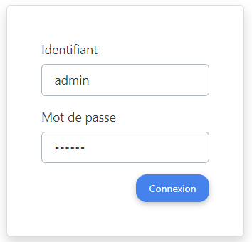

Modifier les informations du compte :

Dans ce cas de test, nous allons procéder à la modification du mot de
passe du compte,

puis vérifier que la connexion avec l'ancien mot de passe "testps" n'est
plus possible, tandis

qu'avec le nouveau mot de passe "testpp", la connexion s'effectue avec
succès.

On modifie les informations du compte :
____

[width="100%",cols="50%,50%",options="header",]
|===
|. a|
____
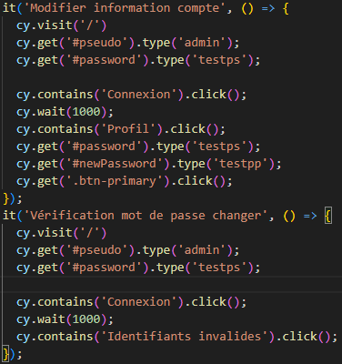
____

|===

____
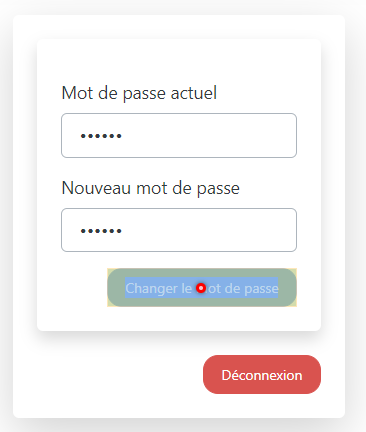

Puis on essaye de se connecter avec l’ancien mot de passe :

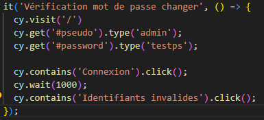

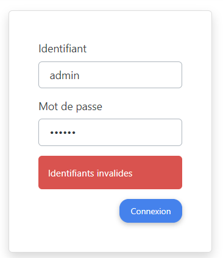

Enfin nous allons tenter la connexion en utilisant le nouveau mot de
passe. L'objectif est d'être redirigé vers la page des vacataires et de
visualiser la chaîne de caractères "Bastien", qui correspond à un
vacataire existant :

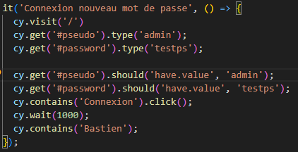
____

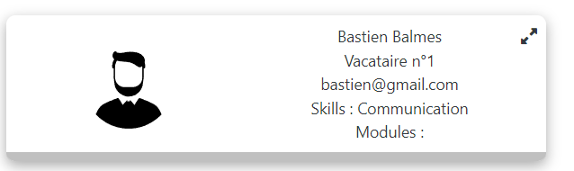

____
{empty}2. CRUD vacataires
____

[width="100%",cols="34%,33%,33%",options="header",]
|===
a|
[width="100%",cols="100%",options="header",]
!===
!
!===

|Attendu |Résultat
|===

[width="100%",cols="34%,33%,33%",options="header",]
|===
a|
____
Création d’un vacataires
____

a|
____
Un nouveau vacataire apparaît dans la liste
____

a|
____
Ok
____

|===

[width="100%",cols="34%,33%,33%",options="header",]
|===
a|
____
Suppression d’un
____

a|
____
des vacataires
____

a|
____
Ok
____

| a|
____
Le vacataire choisie pour être supprimer
____

|
a|
____
vacataires
____

|n'apparaît plus dans la liste des vacataires a|
____
Ok
____

|Lire les informations d’un a|
____
Ouvre un modal avec les informations du
____

|
a|
____
vacataires
____

a|
____
vacataires
____

a|
____
Ok
____

a|
____
Modifier les informations
____

a|
____
Change les informations du vacataire choisi
____

|
|===

[width="100%",cols="100%",options="header",]
|===
a|
____
d’un vacataires
____

|===

____
Création d’un vacataires :

Dans cette procédure de test, nous allons créer un vacataire. Pour ce
faire, nous allons

cliquer sur le bouton "Ajouter un vacataire", ce qui ouvrira un
formulaire dans une fenêtre

modale permettant de créer un nouveau vacataire. Ensuite, nous allons
saisir les

informations requises dans le formulaire, le valider, puis vérifier la
présence de la chaîne de

caractères "Bastien" sur notre page, correspondant ainsi au prénom du
nouveau vacataire

créé.
____

image:vertopal_3bdbc39b934646b3a87a44c669222622/media/image11.png[image,width=596,height=475]

____
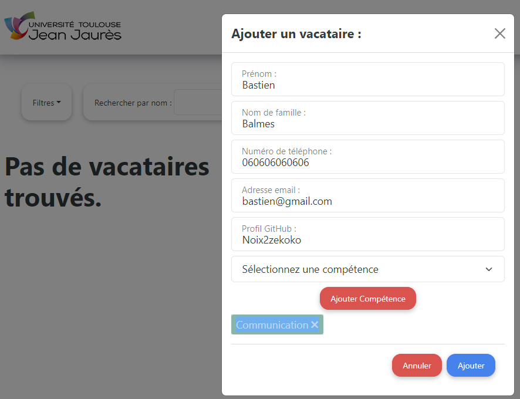

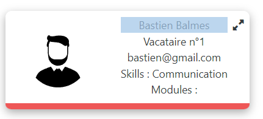

Suppression d’un vacataire :

Dans ce scénario de test, notre objectif est de supprimer un vacataire.
Nous commencerons par cliquer sur le bouton pour ouvrir une fenêtre
modale affichant les informations du vacataire. Ensuite, nous
procéderons en cliquant sur le bouton "Supprimer". Pour conclure, nous
vérifierons que le vacataire supprimé n'est plus présent.

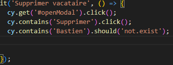

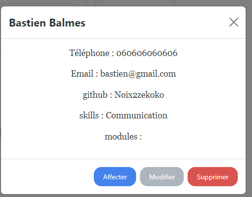
____

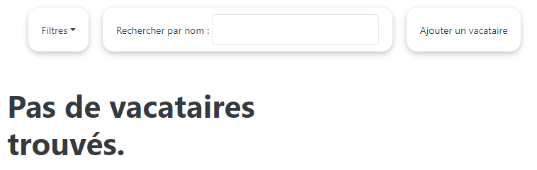

____
Lire les informations d’un vacataire :

Dans ce test, notre but est de lire les informations d'un vacataire.
Nous allons confirmer que

son adresse e-mail correspond bien à "bastien@gmail.com".
____

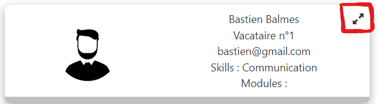

____
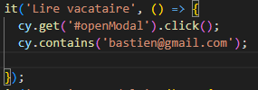

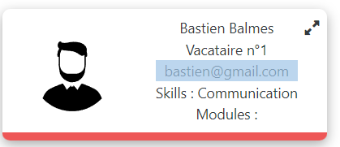

Modifier les informations d’un vacataire :

Dans cette séquence de test, notre démarche consiste à d'abord créer un
nouveau vacataire sous le nom "Enzo Mancini". Ensuite, nous allons
procéder à la modification de ses +
informations pour le transformer en "Balmes Bastien". Enfin, nous
vérifierons que "Bastien" est désormais présent dans la liste des
vacataires, tandis qu'"Enzo" ne sera plus répertorié.
____

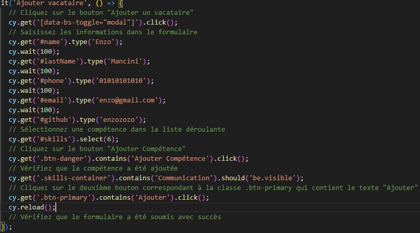

____
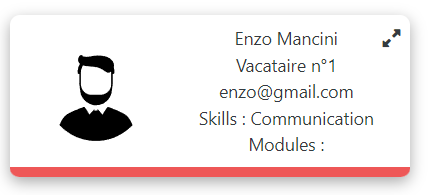

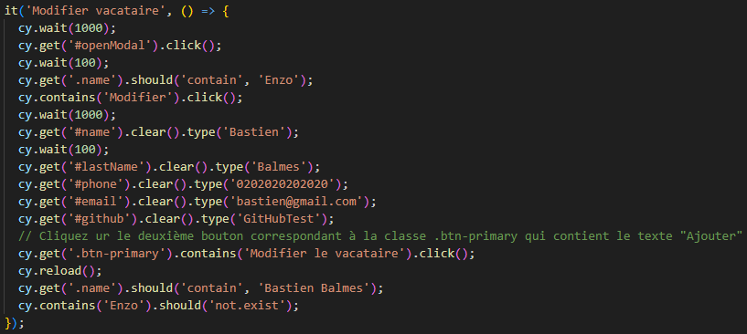
____

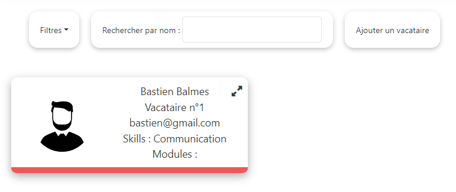

____
{empty}3. CRUD modules
____

[width="100%",cols="34%,33%,33%",options="header",]
|===
a|
[width="100%",cols="100%",options="header",]
!===
!
!===

a|
____
Attendu
____

a|
____
Résultat
____

a|
____
Création d’un module
____

a|
____
Un nouveau module apparaît dans la liste
____

a|
____
Ok
____

|===

[width="100%",cols="34%,33%,33%",options="header",]
|===
|Suppression d’un module a|
____
des module
____

|Ok
| a|
____
Le module choisie pour être supprimer
____

|
|===

[width="100%",cols="34%,33%,33%",options="header",]
|===
a|
____
Lire les informations d’un
____

a|
____
n'apparaît plus dans la liste des modules
____

a|
____
Ok
____

| a|
____
Ouvre un modal avec les informations du
____

|
a|
____
module
____

a|
____
module
____

a|
____
Ok
____

a|
____
Modifier les informations
____

|Change les informations du module choisi |
|===

[width="100%",cols="100%",options="header",]
|===
a|
____
d’un module
____

|===

____
Création d’un module :

Dans ce scénario de test, nous allons créer un module. Pour ce faire,
nous commencerons par cliquer sur le bouton "Ajouter un module", ce qui
ouvrira une fenêtre modale contenant un formulaire pour la création du
module. Ensuite, nous saisirons les informations requises dans le
formulaire, le validerons, et vérifierons que la chaîne de caractères
"Base de données relationnelle" est bien présente sur la page. Cette
chaîne correspond au nom du nouveau module que nous venons de créer.
____

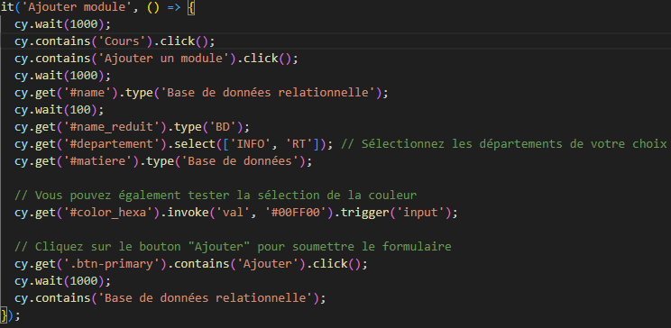

____
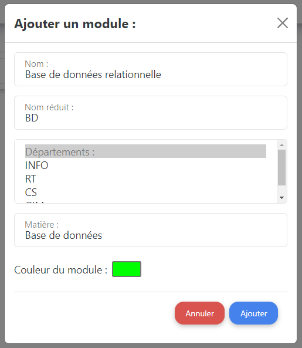

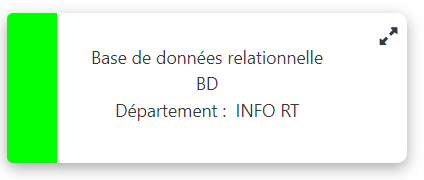

Suppression d’un module :

Dans ce scénario de test, notre objectif est de supprimer un module.
Nous allons +
commencer par cliquer sur le bouton permettant d'ouvrir une fenêtre
modale qui affiche les informations du module. Ensuite, nous cliquerons
sur le bouton "Supprimer". Pour conclure, nous vérifierons que le module
supprimé n'est plus présent.

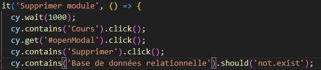

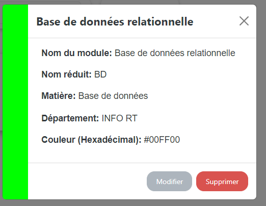
____

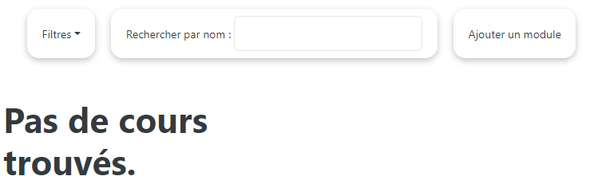

____
Lire les informations d’un module :

Dans ce scénario de test, nous allons lire les informations d'un module
et nous assurer que son nom abrégé est correct "BD".

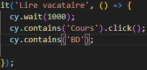

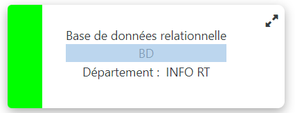

Modifier les informations d’un module:

Dans cette procédure de test, nous allons débuter en créant un nouveau
module sous l'intitulé "Base de données relationnelle". Par la suite,
nous procéderons à la modification de ses informations pour le
transformer en "Dev Java". Enfin, nous confirmerons que "Dev Java" est à
présent répertorié dans la liste des modules, tandis que "Base de
données relationnelle" ne sera plus présent.
____

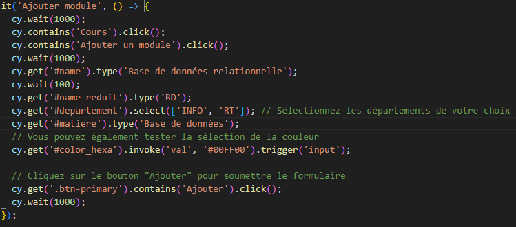

____
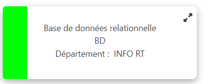

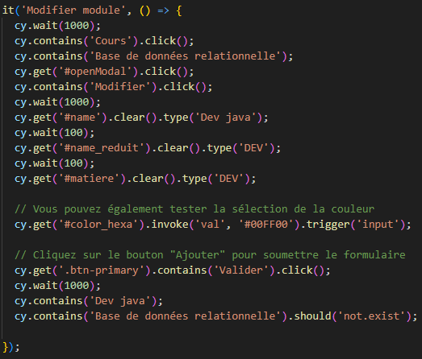

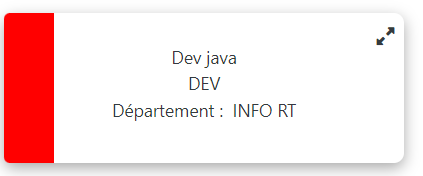

{empty}4. Filtre vacataires
____

[width="100%",cols="34%,33%,33%",options="header",]
|===
a|
[width="100%",cols="100%",options="header",]
!===
!
!===

a|
____
Attendu
____

a|
____
Résultat
____

a|
____
Filtre vacataire affecté
____

a|
____
On voit à l’écran seulement les vacataires
____

a|
____
Ok
____

|===

[width="100%",cols="34%,33%,33%",options="header",]
|===
|Filtre vacataire non affecté a|
____
affectés à un module
____

a|
____
Ok
____

| a|
____
On voit à l’écran seulement les vacataires
____

|
|===

[width="100%",cols="34%,33%,33%",options="header",]
|===
a|
____
Filtre vacataire en attente
____

a|
____
qui ne sont pas affectés à un module
____

a|
____
Ok
____

| |On voit à l’écran seulement les vacataires |
|===

en attente (ceux qui ont déjà eux une

affectation de module, mais n’en ont plus

[width="100%",cols="34%,33%,33%",options="header",]
|===
a|
____
Filtre des affectation par
____

a|
____
actuellement)
____

a|
____
Ok
____

| |On voit à l’écran seulement les vacataires |
a|
____
matière
____

a|
____
qui sont affectés à une matière précise
____

a|
____
Ok
____

a|
____
Recherche d’un vacataire
____

a|
____
On voit à l’écran seulement le vacataire
____

|
a|
____
en fonction du nom
____

a|
____
rechercher s’il existe
____

|
|===

____
Filtre vacataire affecté :

Dans ce scénario de test, nous allons utiliser le filtre pour afficher
les vacataires affectés. Parmi les trois vacataires disponibles, Bastien
Balmes, Enzo Mancini et Victor Thompson, seul Enzo Mancini est affecté à
un module. Par conséquent, sur l'écran, nous ne verrons que les
informations d'Enzo Mancini.
____

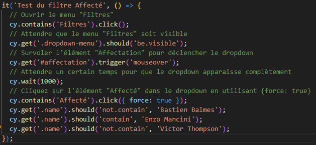

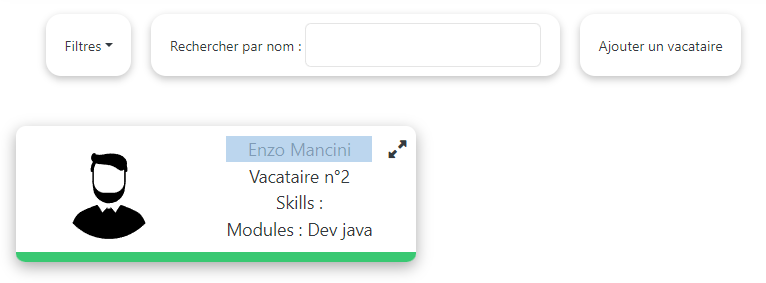

____
Filtre vacataire non affecté :

Dans ce scénario de test, nous allons utiliser le filtre pour afficher
les vacataires non affectés. Parmi les trois vacataires disponibles,
Bastien Balmes, Enzo Mancini et Victor Thompson, seul Enzo Mancini est
affecté à un module. Par conséquent, sur l'écran, nous verrons les
informations de Bastien Balmes et Victor Thompson.
____

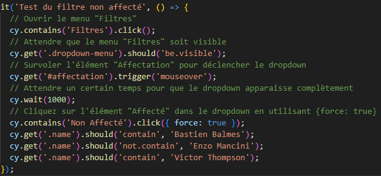

____
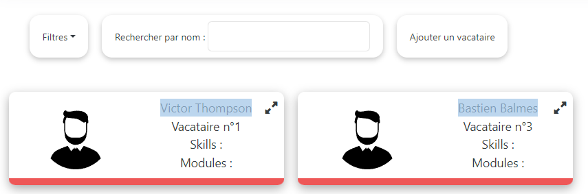

Filtre vacataire en attente :

Dans ce test, nous allons utiliser le filtre pour afficher les
vacataires en attente. Parmi les trois vacataires disponibles, Bastien
Balmes, Enzo Mancini et Victor Thompson, seul Enzo Mancini est affecté à
un module. Par conséquent, sur l'écran, nous ne devrions voir aucun
vacataire, car aucun d'entre eux n'est actuellement en attente.
____

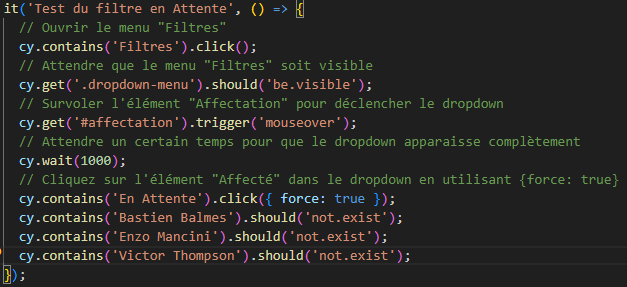

image:vertopal_3bdbc39b934646b3a87a44c669222622/media/image41.png[image,width=602,height=191]

____
Filtre par matière :

Dans ce scénario de test, nous allons utiliser le filtre pour afficher
les vacataires non affectés. Parmi les trois vacataires disponibles,
Bastien Balmes, Enzo Mancini et Victor Thompson, seul Enzo Mancini est
affecté à un module. Par conséquent, sur l'écran, nous ne verrons que
les informations d'Enzo Mancini.
____

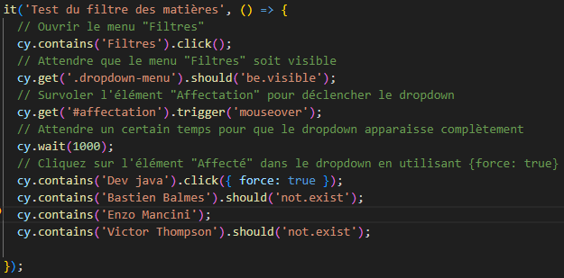

____
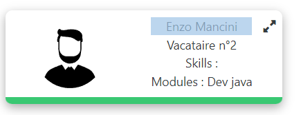

Recherche d’un vacataire en fonction de son nom : +
Dans ce scénario de test, nous allons utiliser une barre de recherche
pour trouver un vacataire spécifique, en l'occurrence "Bastien". Si ce
vacataire a été créé, nous verrons seulement les informations de Bastien
Balmes sur l'écran.

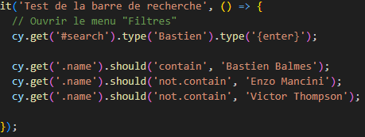
____

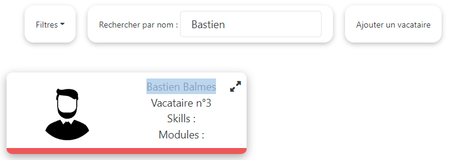

____
{empty}5. Filtre modules
____

[width="100%",cols="34%,33%,33%",options="header",]
|===
a|
[width="100%",cols="100%",options="header",]
!===
!
!===

a|
____
Attendu
____

a|
____
Résultat
____

a|
____
Filtre par matière
____

a|
____
On voit à l’écran seulement les modules qui
____

a|
____
Ok
____

|===

[width="100%",cols="34%,33%,33%",options="header",]
|===
a|
____
Filtre par département
____

a|
____
correspondent à la matière sélectionner
____

a|
____
Ok
____

| a|
____
On voit à l’écran seulement les modules qui
____

|
|===

[width="100%",cols="100%",options="header",]
|===
|appartiennent à un certain département
|===

____
Filtre par matière :

Dans ce scénario de test, nous allons utiliser le filtre pour afficher
les modules par matière.

Nous avons créé 4 modules "Graphes" qui appartiennent à la matière
"math", un module

"Matrice" également associé à la matière "math", ainsi que les modules
"Com" et "BD". Pour

ce test, nous chercherons les modules ayant la matière "math", et sur
l'écran, nous verrons

les modules "Graphes" et "Matrice".

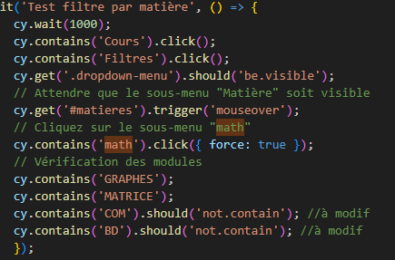

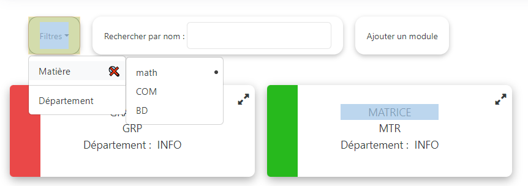

Filtre par département:

Dans ce cas de test, nous allons utiliser le filtre pour afficher les
modules par département.

Nous avons créé 4 modules "Graphes" qui appartiennent à la matière math,
un module "Matrice" également associé à la matière math, ainsi que les
modules "Com" et "BD". Pour ce test, nous chercherons les modules ayant
pour département "INFO", et sur l'écran, nous verrons les modules
"Graphes", "Matrice" et "BD".

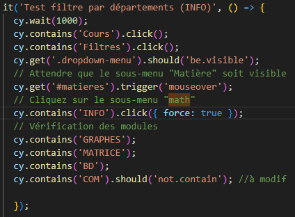
____

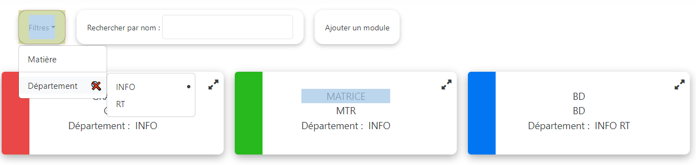

____
Même test mais avec le département RT :
____

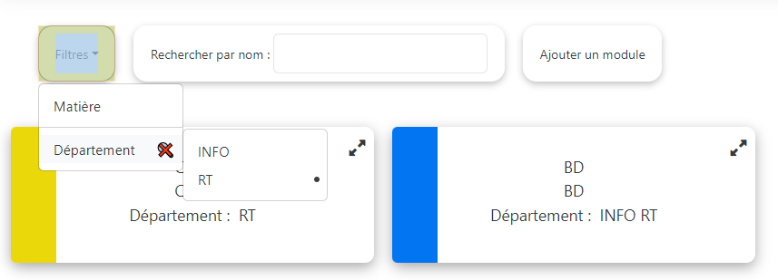
